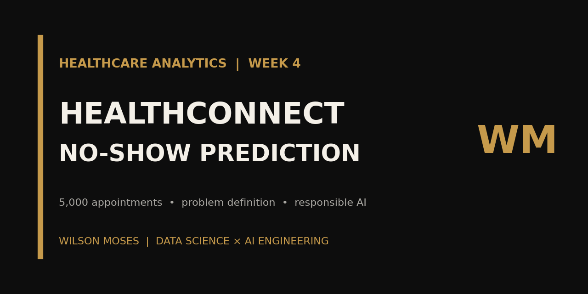
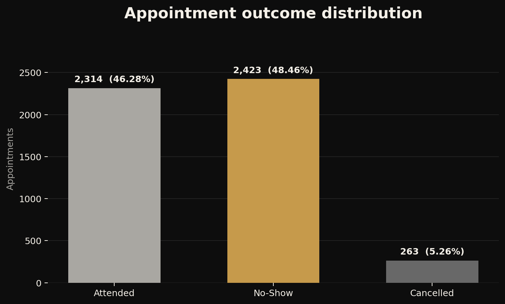
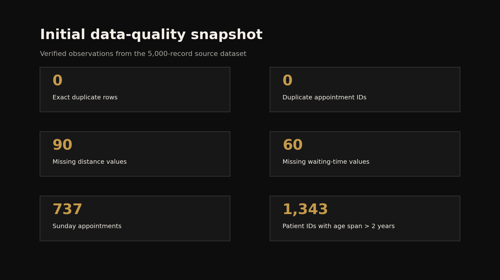

<p align="center">
  
</p>

<p align="center">
  <a href="https://www.linkedin.com/in/wilson-moses-9207b22bb">LinkedIn</a>
  ·
  <a href="https://github.com/WilsonMoses-Data">GitHub</a>
  ·
  <a href="https://www.tiktok.com/@moses.learnsdata">Moses Learns Data</a>
</p>

# HealthConnect: Intelligent Appointment Management

> An ongoing healthcare data-science project investigating whether pre-appointment information can support responsible no-show prediction and more effective attendance interventions.



## Project snapshot

| Project detail | Information |
|---|---|
| Domain | Healthcare Analytics |
| Context | AnalystLab Africa Data Science Internship — Experience Lab Week 4 |
| Status | Ongoing |
| Current phase | Problem definition and initial data assessment |
| Dataset | 5,000 fictional appointment records and 18 variables |
| Proposed task | Supervised binary classification at appointment level |
| Core tools used | Python, pandas, NumPy and Jupyter Notebook |
| Current deliverables | Executed notebook, formal report, project summary, data dictionary and initial visuals |

## Project overview

Missed appointments can leave clinical capacity underused, disrupt schedules and limit timely patient support. HealthConnect currently has limited data-driven capability to identify scheduled appointments that may be at risk of becoming no-shows.

This project applies the IBM Data Science Methodology to determine whether historical appointment data can support a responsible and operationally useful attendance-intervention workflow.

> **Core question:** Can information available before a scheduled appointment help identify appointments at risk of becoming no-shows and support more effective attendance interventions?

This repository documents an educational prototype. It does not present a completed model, production deployment or validated clinical system.

## Objectives

1. Translate the clinic problem into a clear analytical task.
2. Assess whether the supplied data is relevant, reliable and available at the intended prediction point.
3. Explore factors associated with attendance and no-shows.
4. Prepare a reproducible and leakage-safe modelling dataset.
5. Establish an interpretable baseline and compare suitable classification models.
6. Evaluate predictive performance, operational usefulness and fairness.
7. Demonstrate how risk estimates could support clinic workflows.
8. Define a feedback process for monitoring outcomes and model performance.

## Analytical definition

| Element | Definition |
|---|---|
| Positive class | `No-Show` |
| Negative class | `Attended` |
| Unit of analysis | One scheduled appointment |
| Proposed output | Probability that an appointment results in a no-show |
| Provisional prediction point | After booking and before the appointment occurs |

`Cancelled` appointments remain in the raw dataset but are excluded from the first proposed binary experiment. They are not automatically treated as attended appointments or no-shows.

## Dataset

The supplied fictional and anonymised dataset contains one row per scheduled appointment. A patient identifier may therefore occur in more than one row.

| Measure | Value |
|---|---:|
| Appointment records | 5,000 |
| Variables | 18 |
| Anonymised patient identifiers | 1,696 |
| No-shows | 2,423 |
| Attended appointments | 2,314 |
| Cancelled appointments | 263 |
| Provisional binary cohort | 4,737 |
| No-show rate in binary cohort | 51.15% |

See the [dataset documentation](data/README.md) and [data dictionary](data/healthconnect_data_dictionary.csv) for definitions, provenance and current quality considerations.

## Initial data assessment

### Positive findings

- No exact duplicate rows were detected.
- All 5,000 appointment identifiers are unique.
- Derived weekday and booking-lead-day fields agree with their source dates.
- Previous no-show counts do not exceed previous appointment counts.
- The provisional binary target is approximately balanced.

### Issues requiring investigation

| Issue | Evidence | Current treatment |
|---|---:|---|
| Missing distance | 90 records | Investigate pattern; handle within training data only |
| Missing waiting time | 60 records | Confirm prediction-time availability before use |
| Meaningful `None` reminder category | 1,366 records | Retain as “no reminder channel” rather than unknown missingness |
| Date-format mismatch | Dictionary states ISO; CSV uses month/day/year | Parse explicitly and document the observed format |
| Sunday scheduling conflict | 737 appointments | Seek clarification; do not silently remove records |
| Repeated-ID age inconsistency | 1,343 patient IDs span more than two years of age | Avoid direct patient-ID prediction and limit longitudinal claims |

The actual operational variable is `waiting_time_minutes`. Its creation time remains unspecified, so it will not be used until prediction-time availability is clarified.

## Visual evidence

### Appointment outcomes



### Initial data-quality snapshot



## Methodology

| IBM Data Science stage | Application to HealthConnect |
|---|---|
| Business Understanding | Define the operational problem, stakeholders, intended intervention and success criteria |
| Analytical Approach | Translate the business need into descriptive, diagnostic and predictive questions |
| Data Requirements | Determine the required information and when it must be available |
| Data Collection | Review supplied resources, provenance and information gaps |
| Data Understanding | Examine structure, distributions, relationships and quality concerns |
| Data Preparation | Define the modelling cohort and build leakage-safe preprocessing |
| Modelling | Establish a baseline and compare suitable classifiers |
| Evaluation | Assess errors, operational value, interpretability and subgroup performance |
| Deployment | Demonstrate how clinic staff could access and act on predictions |
| Feedback | Monitor performance, outcomes, drift and staff feedback |

## Planned modelling and evaluation

1. Confirm the eligible modelling cohort and prediction time.
2. Use a future-oriented train/test split.
3. Fit preprocessing operations using training data only.
4. Establish a simple benchmark.
5. Train an interpretable logistic-regression baseline.
6. Compare selected tree-based alternatives where justified.
7. Evaluate recall, precision, F1-score, confusion matrices, ROC-AUC, PR-AUC and calibration.
8. Select thresholds using clinic priorities and available staff capacity.
9. Review subgroup performance and error differences.
10. Assess whether predictions support a realistic, supportive intervention.

Final metrics and model choices will be published only after modelling and evaluation are completed.

## Project status

| Phase | Status |
|---|---|
| Business understanding and problem definition | Completed |
| Initial data-quality and suitability assessment | Completed |
| Structured exploratory analysis | Planned |
| Data preparation and feature engineering | Planned |
| Modelling | Planned |
| Predictive, operational and fairness evaluation | Planned |
| Deployment demonstration | Planned |
| Feedback and monitoring framework | Planned |

## Repository structure

```text
healthconnect-no-show-prediction/
├── .gitignore
├── LICENSE
├── README.md
├── requirements.txt
├── data/
│   ├── README.md
│   ├── healthconnect_data_dictionary.csv
│   └── raw/
│       └── healthconnect_appointment_data.csv
├── images/
│   ├── appointment-outcomes.png
│   ├── initial-data-quality.png
│   ├── social-preview.png
│   └── wilson-moses-banner.png
├── notebooks/
│   └── 01_ml_problem_definition.ipynb
├── reports/
│   ├── healthconnect_week4_ml_problem_definition_report.pdf
│   └── healthconnect_week4_project_summary.pdf
└── scripts/
    └── generate_readme_visuals.py
```

## Run locally

```bash
git clone https://github.com/WilsonMoses-Data/healthconnect-no-show-prediction.git
cd healthconnect-no-show-prediction

python -m venv .venv
```

Activate the environment:

```bash
# Windows
.venv\Scripts\activate

# macOS or Linux
source .venv/bin/activate
```

Install the dependencies and start Jupyter:

```bash
python -m pip install --upgrade pip
pip install -r requirements.txt
jupyter notebook
```

Run [`notebooks/01_ml_problem_definition.ipynb`](notebooks/01_ml_problem_definition.ipynb). To regenerate the README visuals, run:

```bash
python scripts/generate_readme_visuals.py
```

## Reports

- [Machine Learning Problem Definition Report](reports/healthconnect_week4_ml_problem_definition_report.pdf)
- [Week 4 Project Summary](reports/healthconnect_week4_project_summary.pdf)

## Responsible use and limitations

- This is an educational project based on fictional, anonymised data.
- It is not a clinical decision system and must not be used to diagnose patients, rank access to care or deny services.
- Predictive associations must not be presented as causes of patient behaviour.
- Reminder and cancellation timestamps are unavailable, limiting reconstruction of what staff knew at a specific decision point.
- Patient identifiers will not be used as ordinary predictors.
- Demographic variables require necessity and fairness review before modelling.
- Any future intervention should be supportive, transparent and subject to human review.
- Operational readiness, real-world benefit and production deployment are not claimed.

## Skills demonstrated

- Business and analytical problem definition
- IBM Data Science Methodology application
- Dataset suitability and quality assessment
- Target and modelling-cohort definition
- Prediction-time and leakage reasoning
- Responsible-AI boundary setting
- Reproducible notebook documentation
- Technical and business communication

## Learning reflection

HealthConnect strengthened my understanding that a data-science project should not begin with model selection. It begins by defining the decision, the prediction time, the intended action and the evidence required to use a prediction responsibly.

## Next steps

- Conduct structured exploratory analysis across appointment, booking, history, reminder and accessibility variables.
- Investigate missing-value patterns and the Sunday scheduling conflict.
- Confirm feature availability at the proposed prediction point.
- Create a separate prepared dataset and transformation log.
- Define the time-based evaluation strategy before fitting models.

## Author

**Wilson Moses**  
Developing Data Scientist × AI Engineer based in Botswana

[LinkedIn](https://www.linkedin.com/in/wilson-moses-9207b22bb) · [GitHub](https://github.com/WilsonMoses-Data) · [Moses Learns Data](https://www.tiktok.com/@moses.learnsdata)

---

<p align="center"><strong>Learning. Building. Applying.</strong></p>
